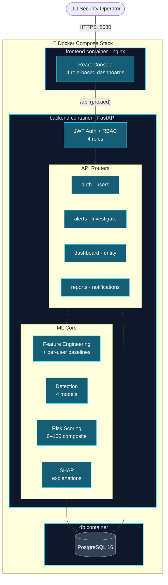
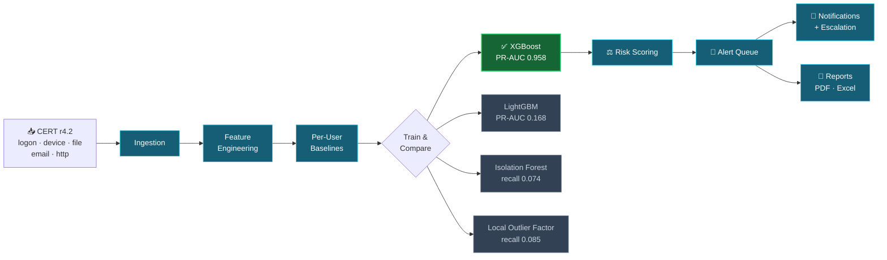
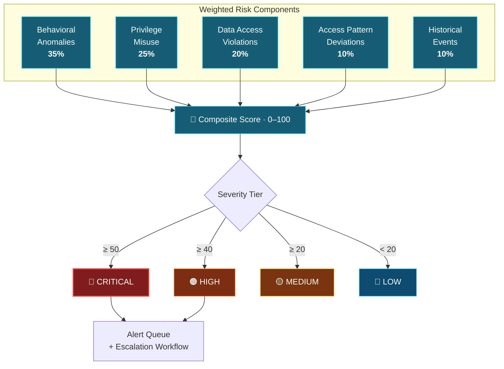
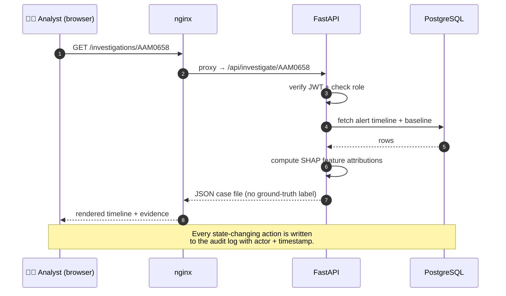

<div align="center">

# 🛡️ Insider Threat Behavioral Intelligence System

### A UEBA platform that catches insider threats by learning how each employee *normally* behaves — then flagging the deviations, with evidence.

[](https://github.com/springboardmentor442n-coder/Insider-Threat-Behavioral-Intelligence-System/actions/workflows/ci.yml)


</div>

---

## What it is

Most insider-threat tooling is a pile of static rules — "alert if a download exceeds
500 MB." Rules miss the careful insider and drown analysts in false positives on the
power user. This system takes the harder, better approach: it builds a **behavioural
baseline for every individual employee** and scores each day against *that person's*
own history. "Unusual" is defined per person, not per policy.

The result, measured on held-out users of the CERT r4.2 benchmark (1,000 employees,
70 insiders, ~32.8M events):

<div align="center">

| Metric | Value | What it means |
|---|:---:|---|
| **User-level recall** | **21 / 21 (100%)** | Every insider in the held-out set was caught |
| **PR-AUC** | **0.958** | Honest headline metric on imbalanced data |
| **F1 score** | **0.89** | Balanced precision/recall at the operating point |
| **False-positive rate** | **0.00061** | ~17–70× lower than commonly cited baselines |

</div>

> These numbers are an **upper bound on clean, synthetic data** — read them alongside
> [`docs/LIMITATIONS.md`](docs/LIMITATIONS.md), which states plainly what the system
> does *not* do (email-only exfiltration is a known blind spot) and why unsupervised
> methods alone were insufficient. Measuring the spec honestly is the point.

---

## ⚡ Quickstart — the whole stack in one command

Docker Desktop running, then:

```bash
docker-compose up --build
```

That's it. On first boot the backend waits for the database, runs every migration,
seeds a demo dataset, and creates a demo administrator — then serves. Open:

| | URL | Login |
|---|---|---|
| **Console** | http://localhost:8080 | `admin@dtaa.com` / `Tr0ub4dor-Horse!` |
| **API docs** | http://localhost:8000/docs | — |

No manual setup, no seed scripts to run by hand. Tear down with `docker-compose down -v`.

---

## 🏗️ System Architecture

Three containers, one network. nginx serves the React console and reverse-proxies
`/api` to FastAPI, so the browser talks to a single origin with no CORS. The backend
carries the ML core; PostgreSQL holds everything.



---

## 🔬 How Detection Works — the ML pipeline

Raw event logs become per-user baselines, four competing detectors are trained and
**measured** against each other, and the winner feeds the risk engine. Nothing here is
asserted — the model comparison is empirical.



> **The measured finding:** unsupervised density methods (Isolation Forest, LOF)
> recover only a small fraction of attacks here — which is *why* the supervised model
> is a necessity, not a preference. Both are kept and reported; the operational model
> is the one that measured better, not the one with the better reputation.

---

## 🔐 Risk Scoring Pipeline

A day's behaviour flows through five weighted components into a 0–100 score, then into
four severity tiers. The thresholds shown were **recalibrated from the real score
distribution** — the spec's original 80/60/35 cutoffs could not fire (0 of 21 insiders
reached HIGH), because no real insider trips every component at once.



---

## 🔄 Component Interaction — an investigation request

What happens when an analyst opens a case file. Note the deliberate omission: the
`is_insider` ground-truth label is **never** returned to the client — an analyst forms
a judgement from evidence, and in production there is no answer key anyway.



---

## 🧰 Tech Stack

| Layer | Technologies |
|---|---|
| **Backend** | Python 3.13, FastAPI, SQLAlchemy, Alembic, Pydantic, slowapi |
| **ML** | scikit-learn, XGBoost, LightGBM, Isolation Forest, LOF, SHAP |
| **Frontend** | React 18, Vite, Chart.js, custom "forensic console" design system |
| **Data** | PostgreSQL 16 |
| **Reports** | reportlab (PDF), openpyxl (Excel) |
| **Auth** | JWT (python-jose), bcrypt, role-based access control |
| **Ops** | Docker, docker-compose, nginx, GitHub Actions CI |

---

## ✅ Module Status

All 13 specification modules are implemented, tested, and CI-green.

| # | Module | # | Module |
|:---:|---|:---:|---|
| 1 | ✅ User Auth & RBAC | 8 | ✅ UEBA Intelligence Engine |
| 2 | ✅ Employee Identity & Profiles | 9 | ✅ Alert & Incident Management |
| 3 | ✅ Activity Monitoring Engine | 10 | ✅ Dashboards & Analytics (×4 roles) |
| 4 | ✅ Behavioral Profiling Engine | 11 | ✅ Notification & Escalation |
| 5 | ✅ Anomaly Detection Engine | 12 | ✅ Reports & Export (5 types × PDF/Excel) |
| 6 | ✅ Insider Risk Scoring Engine | 13 | ✅ Integration, Testing & Deployment |
| 7 | ✅ Threat Investigation Module | | |

---

## 🧪 Testing & CI

```bash
# backend — 135 tests
pytest backend/tests/ -v

# frontend — 10 tests + production build
cd frontend && npm test && npm run build
```

Every push runs the **full pipeline from a clean schema** in GitHub Actions —
migrations → ingest → feature build → four-model training → alert generation → the
entire test suite. Security is tested explicitly: authentication hardening, rate
limiting, and a guard on every endpoint that the `is_insider` ground-truth label can
never leak.

---

## 📁 Project Structure

```
├── backend/
│   ├── app/
│   │   ├── main.py            # FastAPI app + startup schema check
│   │   ├── routers/           # auth, alerts, investigate, dashboard, entity,
│   │   │                      #   reports, notifications, audit, users, data
│   │   ├── features.py        # per-user daily features
│   │   ├── detection.py       # four-detector training + comparison
│   │   ├── scoring.py         # model persistence + inference
│   │   ├── risk.py            # 5-component weighted risk score
│   │   ├── reporting.py       # PDF/Excel document framework
│   │   └── notifications.py   # escalation + notification events
│   └── tests/                 # 135 tests (17 files)
├── frontend/
│   ├── src/
│   │   ├── pages/             # dashboards, alerts, investigations, reports…
│   │   └── components/        # design system, notification bell, shared UI
│   └── Dockerfile             # multi-stage build → nginx
├── scripts/                   # ingest, build_features, train_detect, generate_alerts
├── migrations/                # Alembic versions
├── docs/
│   └── LIMITATIONS.md         # honest assessment — read this
├── Dockerfile                 # backend image (migrate → seed → serve)
├── docker-compose.yml         # full stack, one command
└── requirements.txt
```

---

## 📊 The Dataset

Built and validated on **CERT Insider Threat r4.2** — 1,000 employees, 70 insiders
across three scripted scenarios (a novelty USB-and-leak exfiltration, a job-hunting
USB theft, and a sysadmin planting a keylogger), ~32.8M events spanning Jan 2010 –
May 2011. The dataset is synthetic; see [`docs/LIMITATIONS.md`](docs/LIMITATIONS.md)
for exactly what that implies for every number above.

---

## ⚖️ Limitations

This project's strongest quality is that it **measures the specification instead of
merely implementing it** — and reports what it finds, including the uncomfortable
parts: the prescribed risk thresholds could not fire, the dataset ships two answer
keys that disagree on ~49% of malicious days, unsupervised detection is insufficient,
and the detector is blind to email-only exfiltration. All of it is documented in
**[`docs/LIMITATIONS.md`](docs/LIMITATIONS.md)**. A detection system that states its
own blind spots is more trustworthy than one that claims to have none.

---

<div align="center">

Built as an Infosys SpringBoard internship project · CERT r4.2 · FastAPI · React · Docker

</div>
