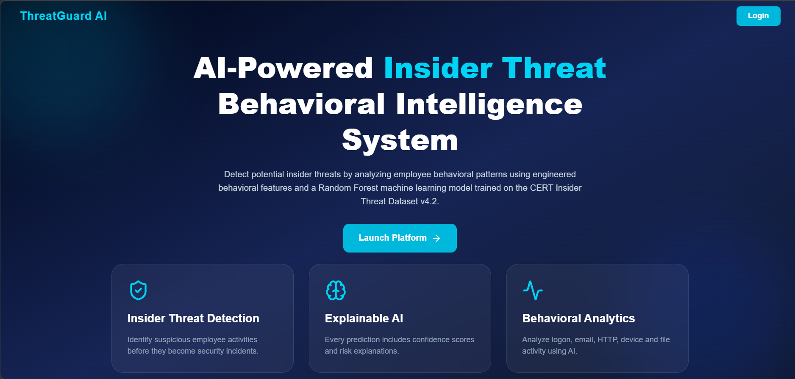
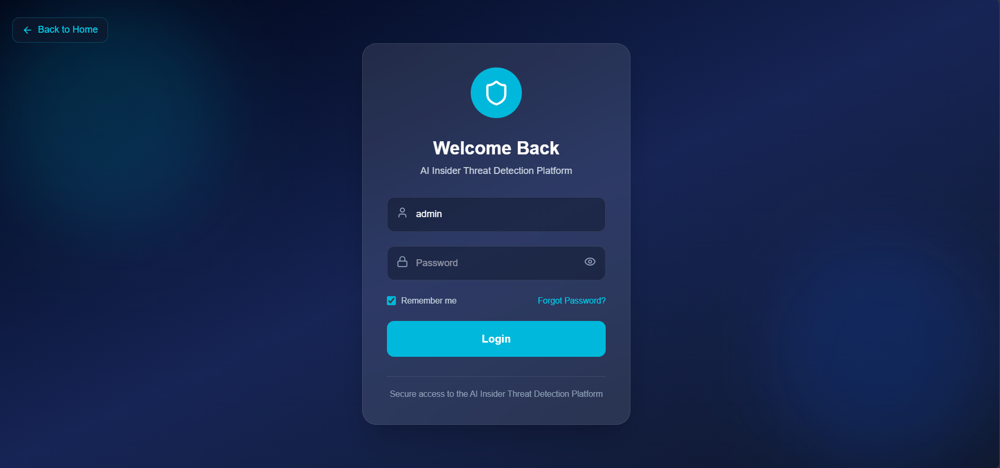
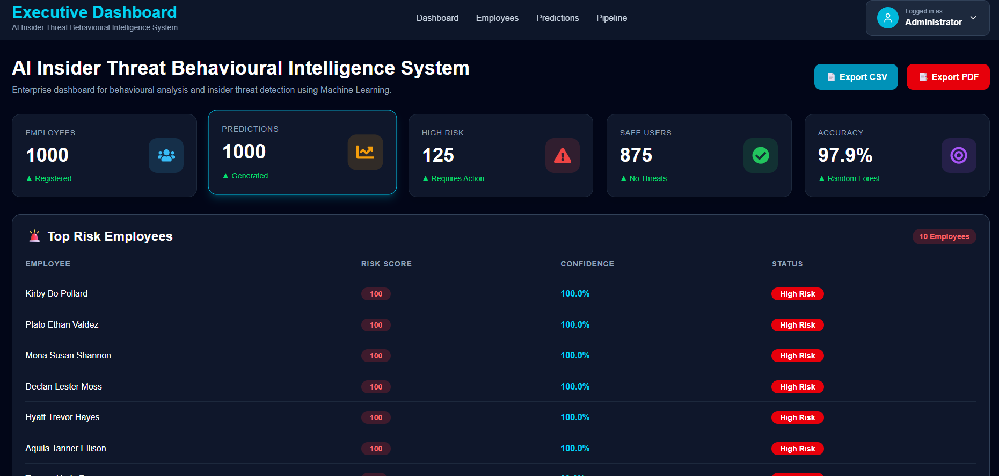
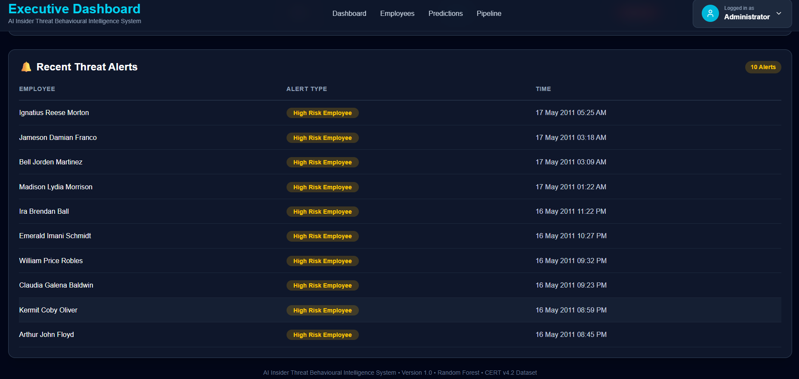
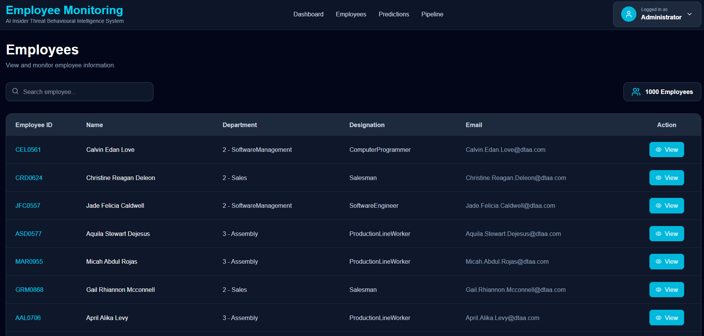
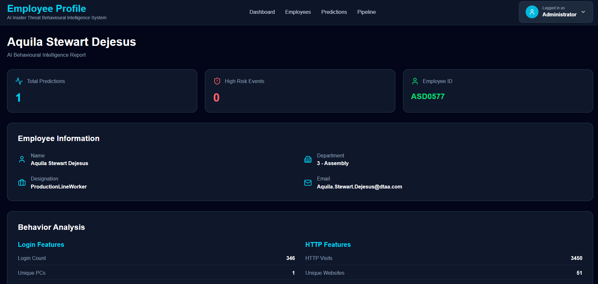
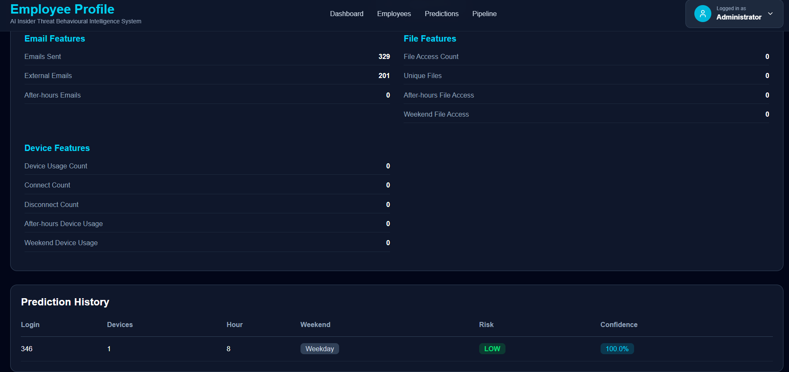
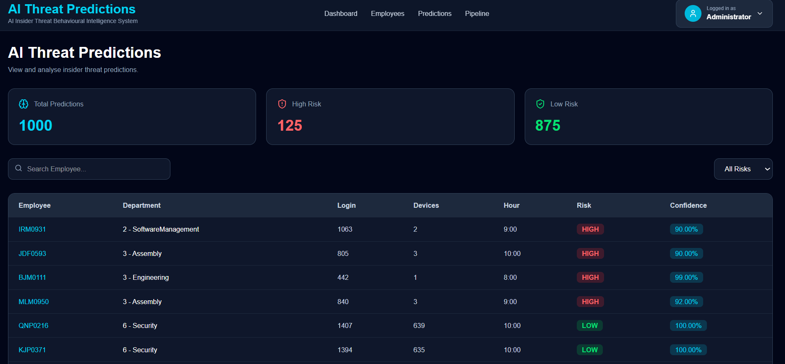
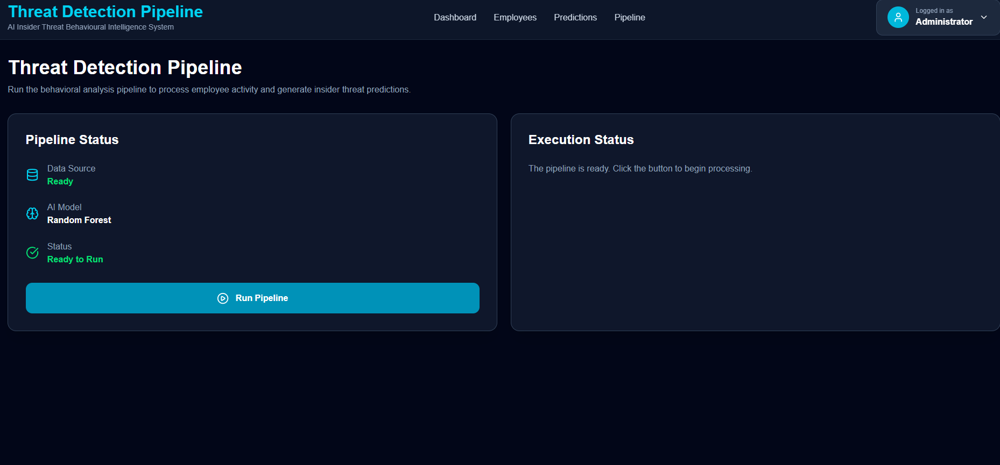

# AI Insider Threat Behavioral Intelligence System

An AI-powered web application designed to detect potential insider threats by analyzing employee behavioral patterns. The system processes the CERT Insider Threat Dataset, extracts behavioral features from employee activities, applies a Random Forest machine learning model, and visualizes the prediction results through an interactive dashboard.

---

# Project Overview

Insider threats are one of the most challenging cybersecurity risks because they originate from authorized users within an organization. Traditional security systems often rely on predefined rules and may fail to identify subtle behavioral changes.

This project analyzes employee activities such as login events, HTTP browsing, email communication, file access, and device usage. These activities are transformed into meaningful behavioral features, which are used to train and predict employee risk using a Random Forest classifier.

---

# Behavioral Feature Engineering

Instead of training the model directly on raw CERT activity logs, the project first generates behavioral features for every employee.

The extracted behavioral features include:

### Login Features
- Login Count
- Unique PC Count
- Weekend Logins
- After Hours Logins
- Average Login Hour

### HTTP Features
- HTTP Visit Count
- Unique Websites Visited
- Weekend HTTP Activity
- After Hours HTTP Activity
- Unique HTTP PCs

### Email Features
- Emails Sent
- External Emails
- After Hours Emails

### File Features
- File Access Count
- Unique Files Accessed
- Weekend File Access
- After Hours File Access

### Device Features
- Device Usage Count
- Connect Count
- Disconnect Count
- Weekend Device Usage
- After Hours Device Usage

These engineered behavioral features are combined into a single dataset (`behavior_features.csv`) which serves as the input for the Random Forest model.

---

# Dataset

**Dataset Used:** CERT Insider Threat Dataset v4.2

The project utilizes multiple datasets from CERT, including:

- LDAP
- Logon
- HTTP
- Email
- File
- Device

These datasets are processed and merged to generate employee behavioral profiles for machine learning.

---

# Features

- Employee Management
- Automated Data Processing Pipeline
- Behavioral Feature Engineering
- Machine Learning-Based Threat Prediction
- High Risk and Low Risk Classification
- Employee Behavior Profiles
- Dashboard Statistics
- Recent Threat Alerts
- Prediction History

---

# Technology Stack

### Frontend
- React
- Vite
- Tailwind CSS
- Framer Motion

### Backend
- FastAPI
- SQLAlchemy
- PostgreSQL

### Machine Learning
- Python
- Pandas
- NumPy
- Scikit-learn
- Random Forest

---

# Project Workflow

```text
CERT Insider Threat Dataset
            │
            ▼
   Data Preprocessing
            │
            ▼
Behavior Feature Engineering
            │
            ▼
Behavior Feature Dataset
            │
            ▼
 Random Forest Prediction
            │
            ▼
 PostgreSQL Database
            │
            ▼
   FastAPI Backend
            │
            ▼
   React Dashboard
```

---

# Application Modules

- Landing Page
- Login
- Dashboard
- Employees
- Predictions
- Pipeline

---

# Project Structure

```text
AI-Insider-Threat-Behavioral-Intelligence-System/
│
├── backend/
│   ├── models/
│   ├── routes/
│   ├── services/
│   ├── pipeline/
│   ├── database/
│   ├── feature_engineering/
│   ├── utils/
│   └── main.py
│
├── frontend/
│   ├── public/
│   ├── src/
│   │   ├── assets/
│   │   ├── components/
│   │   ├── pages/
│   │   └── styles/
│   └── package.json
│
├── dataset/
│
├── README.md
├── requirements.txt
└── .gitignore
```


---

# Results

The system successfully:

- Imports employee information from the CERT dataset.
- Extracts behavioral features from multiple activity logs.
- Generates employee behavioral profiles.
- Applies a Random Forest model for insider threat prediction.
- Classifies employees into High Risk and Low Risk categories.
- Stores prediction results in PostgreSQL.
- Displays employee insights and predictions through an interactive dashboard.

---

# Future Enhancements

- Real-time activity monitoring
- Explainable AI for prediction interpretation
- Continuous model retraining
- Advanced anomaly detection techniques
- Automated alert notifications

---

# Screenshots

### Landing Page


---

### Login


---

### Dashboard




---

### Employees






---

### Predictions


---

### Pipeline Execution


---

# Author

**Sristi K**