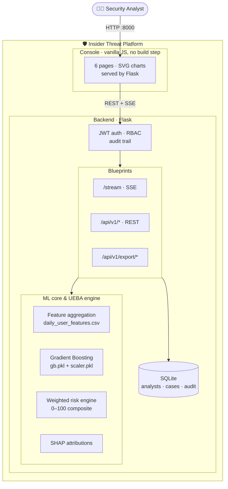
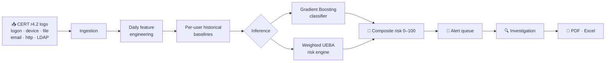
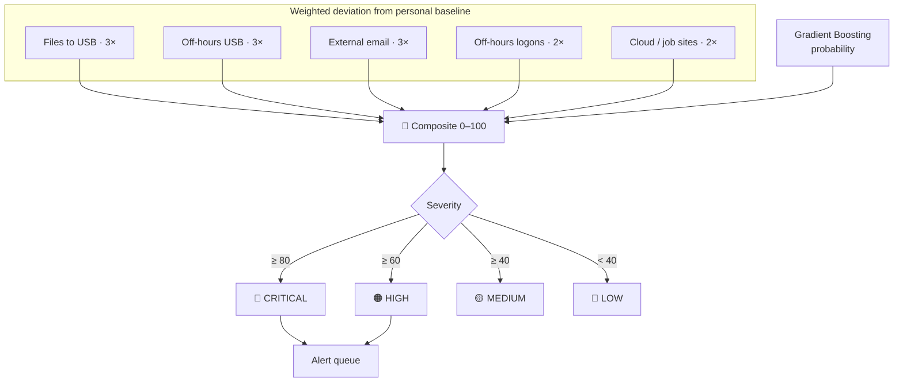

[README.md](https://github.com/user-attachments/files/30863922/README.md)
# 🛡️ Insider Threat Behavioral Intelligence System

An end-to-end **UEBA (User & Entity Behaviour Analytics)** platform that detects
insider threats by measuring how far an employee's daily activity departs from
their own historical baseline. Raw CERT r4.2 activity logs are aggregated into
daily behavioural features, scored by a Gradient Boosting classifier *and* a
weighted behavioural risk engine, explained with SHAP, and surfaced through a
Flask API and a dark security console.

**Activity logs → feature engineering → behavioural baselines → ML detection → UEBA risk scoring → alerts → investigation → reports**

Everything runs from one command. No dataset download, no npm build, no external services.

```bash
pip install -r requirements.txt
python scripts/bootstrap.py      # generate data → engineer features → train
python run.py                    # http://localhost:8000
```

---

## Contents

- [What it does](#what-it-does)
- [Quick start](#quick-start)
- [Architecture](#architecture)
- [Detection pipeline](#detection-pipeline)
- [Risk scoring](#risk-scoring)
- [Explainability](#explainability)
- [The console](#the-console)
- [API reference](#api-reference)
- [Using the real CERT r4.2 dataset](#using-the-real-cert-r42-dataset)
- [Project layout](#project-layout)
- [Testing](#testing)
- [Deployment](#deployment)
- [Configuration](#configuration)
- [Model performance and honest limitations](#model-performance-and-honest-limitations)

---

## What it does

| # | Capability | How it works |
|--:|------------|--------------|
| 1 | **Auth & RBAC** | JWT bearer tokens, PBKDF2-SHA256 passwords, three roles (`viewer` < `analyst` < `admin`) |
| 2 | **Employee profiles** | Identity from LDAP snapshots, joined to behavioural history |
| 3 | **Live monitoring** | Server-Sent Events replay of the raw event log, ~1.5 s cadence, risk-annotated |
| 4 | **Behavioural profiling** | Per-user mean/σ baseline for all 13 behavioural features |
| 5 | **Anomaly detection** | Per-feature deviation in baseline σ units |
| 6 | **Risk scoring** | Composite 0–100 blending weighted UEBA deviation with ML probability |
| 7 | **Investigation** | Deviation table, weighted contributions, SHAP attribution, evidence timeline |
| 8 | **UEBA engine** | Baselines fitted on the training window only — no lookahead |
| 9 | **Alert queue** | User-days above the threshold, with analyst-managed case state |
| 10 | **Executive dashboard** | Population posture, risk trend, severity mix, dominant indicators |
| 11 | **Severity flags** | CRITICAL / HIGH / MEDIUM / LOW at 80 / 60 / 40 / 0 |
| 12 | **Reports** | 6-section PDF case file (ReportLab), 4-sheet Excel workbook (OpenPyXL) |
| 13 | **Audit trail** | Every login, investigation and export recorded and queryable by admins |

---

## Quick start

Requires **Python 3.11+**.

```bash
cd insider-threat-bis

python -m venv .venv && source .venv/bin/activate     # Windows: .venv\Scripts\activate
pip install -r requirements.txt

python scripts/bootstrap.py       # ~90 s: synthesise corpus, build features, train
python run.py
```

Open **http://localhost:8000**.

| Account | Password | Can do |
|---------|----------|--------|
| `admin` | `admin123` | Everything, plus the audit log and model reload |
| `analyst` | `analyst123` | Investigate, manage cases, export PDFs |
| `viewer` | `viewer123` | Read-only dashboards, alerts and Excel exports |

Change these via `.env` before deploying anywhere real (see [Configuration](#configuration)).

### The pipeline as separate steps

```bash
python scripts/generate_data.py --users 160 --days 160   # synthetic CERT-schema corpus
python scripts/build_features.py                         # → data/daily_user_features.csv
python -m app.ml.train                                   # → ml_model/*.pkl + metrics.json
```

`bootstrap.py` skips any step whose output already exists; pass `--force` to rebuild everything.

---

## Architecture



The frontend is plain HTML/CSS/JS served by Flask — there is **no Node toolchain**,
so `python run.py` is genuinely the whole thing. Charts are hand-rolled SVG
(`app/static/js/charts.js`) rather than a charting dependency.

---

## Detection pipeline



### Step 1 — Ingestion

Five raw sources in CERT r4.2 schema. `http.csv` is read in chunks because on the
real dataset it holds ~28 M rows.

### Step 2 — Feature engineering

Each `(user, day)` becomes one row with **13 behavioural features**:

| Source | Features |
|--------|----------|
| logon | `logon_count`, `off_hours_logons`, `distinct_pcs` |
| device | `usb_connects`, `off_hours_usb` |
| file | `files_copied_to_usb`, `sensitive_files_to_usb` |
| email | `total_emails_sent`, `external_emails_sent`, `total_attachments`, `total_email_size` |
| http | `http_requests`, `cloud_job_visits` |

Off-hours means before 07:00 or at/after 18:00. "Sensitive" files are `.doc`, `.pdf`,
`.zip`. External email is any recipient outside `dtaa.com`. Cloud/job sites are
Dropbox, Google Drive, Monster and LinkedIn.

Monthly **LDAP** snapshots add organisational context, label-encoded to
`role_encoded`, `department_encoded`, `supervisor_encoded` — **16 model inputs total**.
Missing months are forward-filled per user. `team_encoded` is dropped: it is nearly
collinear with department and had the worst LDAP coverage.

### Step 3 — Baselines

Per-user mean and σ for every behavioural feature, **fitted on the training split
only** so the evaluation window can't leak into the baselines it is judged against.

### Step 4 — ML detection

A scikit-learn **GradientBoostingClassifier** on MinMax-scaled features, class-balanced
via sample weights. The train/test split is **chronological (70/30)** — a random split
would leak a user's future behaviour into their own training rows and badly overstate
performance.

XGBoost is used automatically when importable; it needs a native OpenMP runtime
(`brew install libomp` on macOS), so scikit-learn is the default. Force either with
`python -m app.ml.train --backend gb|xgboost`.

### Steps 5–9

Risk scoring, severity banding, alerting, investigation and reporting — covered below.

---

## Risk scoring

Two independent signals are blended so neither can dominate alone:

```
composite = 0.55 × UEBA_behavioural + 0.45 × (ML_probability × 100)
```

The **UEBA behavioural score** measures deviation from the subject's own baseline
across five weighted indicators:

| Indicator | Weight |
|-----------|-------:|
| Files copied to USB | 3× |
| Off-hours USB activity | 3× |
| External email volume | 3× |
| Off-hours logons | 2× |
| Cloud / job-site visits | 2× |

For each indicator, `z = (observed − user_mean) / σ`, clipped to `[0, 3σ]` and
normalised to 0–1, then weighted and rescaled to 0–100. σ has a per-feature floor
so a user who has *never* connected a USB stick doesn't register an infinite z-score
the first time they do.



Weights, blend ratio and alert threshold are all configurable in `.env`.

---

## Explainability

Every investigation carries a **SHAP** `TreeExplainer` attribution showing which
features pushed the prediction toward "insider" and which pulled away, rendered as a
diverging bar chart and included in the PDF case file.

If SHAP fails to load, the engine degrades to signed model importances rather than
erroring, and the response's `explanation.method` field says which was used — so the
UI never silently presents one as the other.

---

## The console

Six pages, dark security theme, keyboard-reachable, no build step.

| Page | Contents |
|------|----------|
| **Dashboard** | Posture tiles, daily risk trend, severity mix, dominant indicators, live model metrics |
| **Live Monitoring** | SSE activity feed with per-event risk and off-hours flags |
| **Behavioral Profiling** | Searchable user table → per-user risk history and baseline-vs-observed |
| **Threat Alerts** | Ranked incident queue with lead indicator and case status |
| **Investigation** | Verdict tiles, weighted contributions, SHAP attribution, deviation table, timeline |
| **Reports** | PDF case files and filtered Excel workbooks |

Chart colours follow a validated palette: two categorical hues for series, a
single-hue sequential ramp for magnitude, a blue↔red diverging pair for signed SHAP
values, and a reserved status palette for severity. Severity colour is **always**
paired with a text label, so it never carries meaning alone.

---

## API reference

All `/api/v1/*` routes need `Authorization: Bearer <token>`. `/stream` also accepts
`?token=` because `EventSource` cannot set headers.

```bash
TOKEN=$(curl -s -X POST localhost:8000/api/v1/auth/login \
  -H 'Content-Type: application/json' \
  -d '{"username":"analyst","password":"analyst123"}' | jq -r .access_token)

curl -s localhost:8000/api/v1/dashboard -H "Authorization: Bearer $TOKEN" | jq
```

| Method | Endpoint | Role | Purpose |
|--------|----------|------|---------|
| `POST` | `/api/v1/auth/login` | — | Obtain a JWT |
| `GET` | `/api/v1/auth/me` | viewer | Current analyst |
| `POST` | `/api/v1/auth/logout` | viewer | Record sign-out |
| `GET` | `/api/v1/auth/audit` | **admin** | Audit trail |
| `GET` | `/api/v1/dashboard` | viewer | Executive statistics |
| `GET` | `/api/v1/model/metrics` | viewer | Held-out evaluation metrics |
| `POST` | `/api/v1/model/reload` | **admin** | Hot-reload artefacts after retraining |
| `GET` | `/api/v1/users` | viewer | Paged user list (`search`, `severity`, `page`) |
| `GET` | `/api/v1/users/<id>/profile` | viewer | Baseline + risk history |
| `GET` | `/api/v1/alerts` | viewer | Alert queue (`severity`, `min_score`, `limit`) |
| `GET` | `/api/v1/alerts/cases` | viewer | Analyst case state |
| `POST` | `/api/v1/alerts/cases` | analyst | Create/update a case |
| `GET` | `/api/v1/investigate/<id>` | analyst | Full forensic case (`?day=`) |
| `POST` | `/api/v1/score` | analyst | What-if scoring of a feature vector |
| `GET` | `/api/v1/features` | viewer | Feature contract, weights, thresholds |
| `GET` | `/stream` | viewer | SSE activity feed |
| `GET` | `/api/v1/monitor/recent` | viewer | Polling fallback for the feed |
| `GET` | `/api/v1/export/pdf` | analyst | Investigation case file (`?user=&day=`) |
| `GET` | `/api/v1/export/excel` | viewer | Risk workbook (`?user=&severity=&min_score=`) |
| `GET` | `/health` | — | Liveness + engine readiness |

### What-if scoring

Omitted features are filled from **that user's own baseline**, not zero — a vector
with 40 files copied to USB but zero logons and zero HTTP traffic never occurs in
training, and the model's opinion of it would be meaningless. The response reports
which features you supplied and which were defaulted.

```bash
curl -s -X POST localhost:8000/api/v1/score -H "Authorization: Bearer $TOKEN" \
  -H 'Content-Type: application/json' \
  -d '{"user":"ABC1234","features":{"files_copied_to_usb":40,"off_hours_usb":6}}'
```

---

## Using the real CERT r4.2 dataset

The genuine **CERT Insider Threat Dataset r4.2** (~10 GB, licence-gated) is not
redistributable, so `scripts/generate_data.py` synthesises a corpus with the
*identical* schema — same five log files, same columns, same monthly `LDAP/`
snapshots, same `answers/` ground-truth key. Every downstream stage is byte-identical
in behaviour between the two.

To use the real data, extract it and point the pipeline at it:

```bash
export CERT_RAW_DIR=/path/to/r4.2      # containing logon.csv, device.csv, …, LDAP/, answers/
python scripts/bootstrap.py --raw "$CERT_RAW_DIR" --force
```

Labels come from `answers/` when present (the parser handles the mixed-record-type
format and unquoted commas in `content`). Without it, the pipeline falls back to a
conservative heuristic labeller and says so in the build log.

---

## Project layout

```text
insider-threat-bis/
├── run.py                      # dev entrypoint
├── wsgi.py                     # gunicorn entrypoint
├── config.py                   # all configuration, .env-driven
├── requirements.txt
├── Dockerfile / docker-compose.yml
│
├── app/
│   ├── __init__.py             # application factory
│   ├── auth.py                 # JWT issue/verify, @require_auth(role)
│   ├── models.py               # Analyst, AlertCase, AuditLog
│   ├── api/
│   │   ├── auth_routes.py      # login, me, logout, audit
│   │   ├── intel_routes.py     # dashboard, users, alerts, investigate, score
│   │   ├── monitor_routes.py   # SSE stream + polling fallback
│   │   └── export_routes.py    # PDF and Excel
│   ├── ml/
│   │   ├── features.py         # CERT ingestion + daily aggregation
│   │   ├── ueba.py             # baselines, deviation, weighted risk
│   │   ├── train.py            # chronological split, training, metrics
│   │   └── engine.py           # runtime scoring singleton + SHAP
│   ├── services/
│   │   ├── stream.py           # activity replay buffer
│   │   ├── reports.py          # ReportLab PDF, OpenPyXL workbook
│   │   └── directory.py        # LDAP-backed identity lookup
│   ├── static/{css,js}         # console.css, charts.js, app.js
│   └── templates/index.html
│
├── scripts/
│   ├── generate_data.py        # synthetic CERT r4.2-schema corpus
│   ├── build_features.py       # → data/daily_user_features.csv
│   └── bootstrap.py            # one-command setup
│
├── ml_model/                   # gb.pkl, scaler.pkl, feature_columns.pkl,
│                               # feature_means.pkl, baselines.pkl, metrics.json
├── data/                       # raw/ logs + daily_user_features.csv
└── tests/                      # 55 tests
```

---

## Testing

```bash
pip install -r requirements-dev.txt
pytest -q
```

**55 tests** covering feature-engineering correctness (off-hours windows, sensitive
extensions, external-recipient classification), UEBA properties (zero at baseline,
saturation at 100, monotonicity, weight ordering, severity bands), model sanity,
the full API contract, RBAC on every protected route, and PDF/Excel output shape.

Tests use an isolated SQLite database and skip automatically if model artefacts are
absent, so a fresh clone doesn't produce spurious failures.

There is also `scripts/_uicheck.py`, a Playwright script that drives all six console
pages, captures screenshots and asserts a clean console:

```bash
python -m playwright install chromium
python scripts/_uicheck.py http://localhost:8000
```

---

## Deployment

### Docker

```bash
docker compose up --build      # http://localhost:8000
```

The image runs `bootstrap.py` at build time so the container starts ready to serve.
Analyst accounts, cases and the audit log persist in a named volume. To use the real
dataset, uncomment the `CERT_RAW_DIR` env var and the bind mount in
`docker-compose.yml`.

### Gunicorn

```bash
gunicorn --bind 0.0.0.0:8000 --workers 2 --threads 8 --timeout 0 wsgi:app
```

**Threads are required** — the SSE endpoint holds a worker for the life of the
stream, so a thread-less worker pool will deadlock under more than a couple of
concurrent viewers. `--timeout 0` stops gunicorn reaping long-lived streams.

Behind nginx, disable proxy buffering on `/stream` (`proxy_buffering off;`) or events
will arrive in batches instead of live.

### Before exposing this publicly

- Set `SECRET_KEY` and `JWT_SECRET` to random values; the app logs a warning while
  the published development secret is in use.
- Change the three seed passwords.
- Terminate TLS at a reverse proxy — JWTs are bearer tokens.
- Move off SQLite (`DATABASE_URL=postgresql://…`) if more than a handful of analysts
  will write case state concurrently.

---

## Configuration

Copy `.env.example` to `.env`. Everything is optional and has a working default.

| Variable | Default | Meaning |
|----------|---------|---------|
| `SECRET_KEY` / `JWT_SECRET` | dev constant | **Change for any real deployment** |
| `JWT_EXPIRY_MINUTES` | `480` | Token lifetime |
| `ADMIN_PASSWORD` / `ANALYST_PASSWORD` / `VIEWER_PASSWORD` | `*123` | Seed passwords, applied on first boot only |
| `DATABASE_URL` | `sqlite:///instance/itbis.db` | Any SQLAlchemy URL |
| `CERT_RAW_DIR` | `data/raw` | Where the raw logs live |
| `UEBA_WEIGHT` / `ML_WEIGHT` | `0.55` / `0.45` | Composite blend |
| `ALERT_THRESHOLD` | `60` | Minimum score to raise an alert |
| `STREAM_INTERVAL_SECONDS` | `1.5` | SSE cadence |
| `HOST` / `PORT` / `DEBUG` | `127.0.0.1` / `8000` / `0` | Dev server |

---

## Model performance and honest limitations

On the default synthetic corpus (160 users × 160 business days, 11 insiders across
the three CERT scenarios, 227 malicious user-days = 0.87 % positive rate):

| Metric | Value |
|--------|------:|
| PR-AUC | 0.89 |
| ROC-AUC | 0.99 |
| Precision | 0.94 |
| Recall | 0.83 |
| F1 | 0.88 |
| User-level recall | 5 / 5 |

Read these with care:

- **Synthetic data is easier than the real thing.** The reference notebook scores
  **PR-AUC ≈ 0.65 / recall ≈ 0.83 / precision ≈ 0.30** on genuine CERT r4.2. Expect
  numbers in that range when you point `CERT_RAW_DIR` at the real dataset. The gap is
  the data, not the model.
- **The model leans heavily on one feature.** Zeroing `sensitive_files_to_usb` on a
  confirmed malicious day drops its predicted probability from 0.99 to ~0.0001. That
  is a property of how cleanly the generator separates exfiltration behaviour, and it
  is exactly the kind of single-feature dependence that would not survive real data.
  The weighted UEBA half of the composite score is deliberately independent of the
  model for this reason.
- **Scores are bimodal on synthetic data.** Benign users cluster near 5 and insiders
  near 90, so the HIGH band can look empty on the dashboard. Real data fills in the
  middle.
- **Baselines need history.** A user with only a few observed days gets a wide σ and
  therefore a conservative score. `baseline_days` is reported in every investigation
  so an analyst can see how much history is behind a verdict.
- **This is decision support, not adjudication.** A high score means "worth a look",
  and the PDF case file says so explicitly.

---

## Attribution

Detection approach, feature engineering and evaluation methodology follow the
reference analysis in `cert-demo.ipynb`, built on the **CERT Insider Threat Dataset
r4.2** (Carnegie Mellon University / ExactData). Original project concept by
**Vinothini R**.
