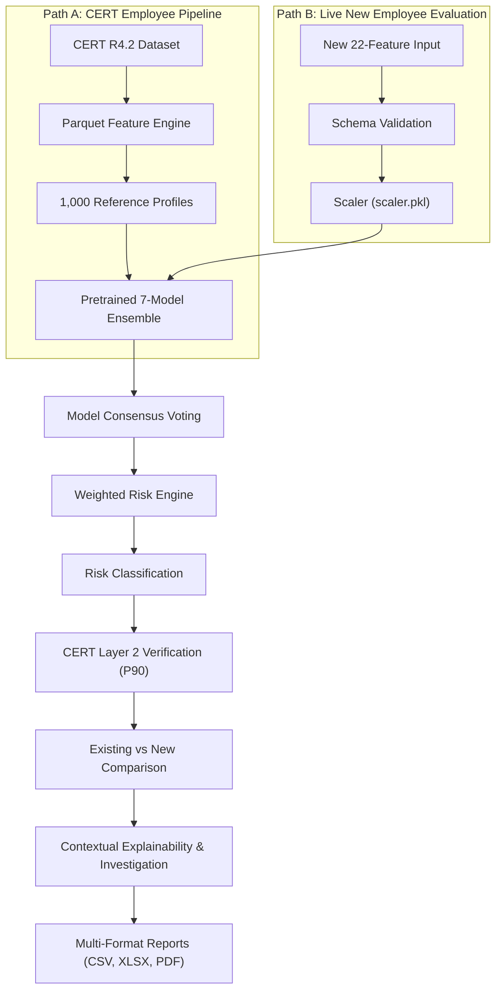
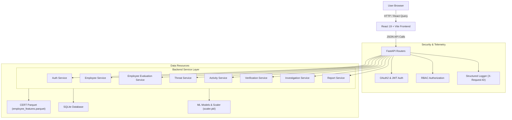
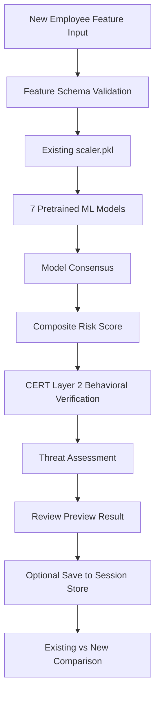

# Insider Threat Behavioral Intelligence System

SentinelAI is an AI-powered insider threat detection and User and Entity Behavior Analytics (UEBA) platform designed to continuously monitor employee activity, evaluate behavioral anomalies, calculate normalized risk scores, and streamline security operations workflows. Built on the authoritative **CERT Insider Threat Dataset (R4.2)**, SentinelAI applies a 7-model unsupervised machine learning ensemble across enterprise log telemetry to detect subtle behavioral deviations.

The platform provides an end-to-end security solution unifying log telemetry ingestion, behavioral feature engineering, multi-model anomaly detection, live out-of-sample employee evaluation, baseline population comparison, weighted risk scoring, SHAP feature explainability, CERT Layer 2 behavioral verification, incident investigation workflows (`CASE-AJF0370`), role-based access control (RBAC), and multi-format reporting (CSV, XLSX, PDF).

---

## Project Overview

| Aspect | Details |
|---|---|
| **Domain** | Cybersecurity / User & Entity Behavior Analytics (UEBA) |
| **Primary Dataset** | CERT Insider Threat Dataset R4.2 (1,000 Reference Employees) |
| **Detection Approach** | Unsupervised Machine Learning Anomaly Detection (No Labeled Training) |
| **ML Ensemble** | 7-Model Ensemble (Isolation Forest, One-Class SVM, LOF, Elliptic Envelope, PCA, DBSCAN, K-Means) |
| **Live Evaluation** | 22 Behavioral Feature Vectors across 5 Categories (Volume, Temporal, Device, Web, Psychometrics) |
| **Population Comparison** | Distinguishes `SOURCE = CERT R4.2` from `SOURCE = NEW_EVALUATION` with Baseline Isolation |
| **Risk Scoring Engine** | 0–100 Normalized Weighted Score (Anomalies 35%, Misuse 25%, Violations 20%, Deviations 10%, History 10%) |
| **Layer 2 Verification** | CERT Population-Level Statistical Baseline Validation (P90 Thresholds) |
| **Primary Navigation** | 6 Workflow Views (Dashboard, Threat Center, Employees, Employee Evaluation, Investigation, Reports) |
| **Contextual Deep Links** | Deep-linked Explainability & Verification drawers from Employee & Threat details |
| **Authentication & RBAC** | OAuth2 Password Flow + JWT Bearer Tokens (Analyst, SOC Engineer, Manager, Administrator) |
| **Frontend Stack** | React 19, Vite, Tailwind CSS, Framer Motion, Recharts, TanStack React Query |
| **Backend Stack** | Python 3.11, FastAPI, Uvicorn, Pydantic v2, SQLAlchemy, Alembic |
| **Reporting & Export** | 19 Canonical Intelligence Reports (CSV, Excel/XLSX, Styled PDF Exports) |

---

## Problem Statement & Objectives

Traditional security monitoring relies on fixed rules and static alerts. However, insider threats are committed by authorized users operating within legitimate boundaries, manifesting as subtle behavioral deviations rather than explicit rule violations.

SentinelAI addresses this challenge through key engineering objectives:
- **Telemetry & Feature Extraction**: Process multi-source telemetry across logon, file, email, web, and USB device streams into 22 statistical feature vectors.
- **Unsupervised Anomaly Ensemble**: Execute 7 distinct unsupervised ML models without ground-truth attack labels.
- **Live Employee Evaluation**: Evaluate new out-of-sample employees against pre-trained ML models and scaler (`scaler.pkl`).
- **Existing vs. New Comparison**: Compare newly evaluated employees against the CERT population baseline without altering baseline percentiles.
- **CERT Layer 2 Verification**: Validate ML anomaly alerts against population-level P90 statistical baseline thresholds.
- **Streamlined SOC Workflows**: Provide a 6-item primary navigation with shared design components (`MetricCard`) and contextual deep-linking.

---

## System Architecture & Flow

SentinelAI follows a decoupled client-server architecture using a React single-page application and FastAPI API routers:





---

## Machine Learning Pipeline & DBSCAN Handling

The platform uses 7 unsupervised anomaly detection models: Isolation Forest, One-Class SVM, LOF, Elliptic Envelope, PCA, DBSCAN, and K-Means. Feature vectors pass through each model to calculate a model consensus percentage ($0\text{--}100\%$).

### Out-of-Sample DBSCAN Limitation
During live single-employee evaluation, DBSCAN is explicitly reported as **not directly inferable**. Because scikit-learn's fitted DBSCAN model does not implement an out-of-sample `.predict()` method for unseen vectors, SentinelAI gracefully flags DBSCAN as non-inferable for new inputs rather than raising runtime errors.

---

## Risk Scoring Engine & Authoritative Boundaries

SentinelAI calculates a normalized **0–100 Insider Risk Score**:

$$\text{Insider Risk Score} = 0.35(\text{Anomalies}) + 0.25(\text{Misuse}) + 0.20(\text{Violations}) + 0.10(\text{Deviations}) + 0.10(\text{History})$$

### Risk Level Classification
- **Low Risk ($0.0\text{--}24.9$)**: Normal operational activity.
- **Medium Risk ($25.0\text{--}49.9$)**: Minor deviations requiring routine monitoring.
- **High Risk ($50.0\text{--}74.9$)**: Significant anomaly detection prioritized for triage.
- **Critical Risk ($75.0\text{--}100.0$)**: Severe multi-vector anomalies triggering immediate escalation.

---

## Ground-Truth & ML Disclaimer

> [!IMPORTANT]
> **Methodological Note**: The primary ML pipeline in SentinelAI is strictly **unsupervised**. The dataset contains no ground-truth malicious or benign labels used during training. The CERT Layer 2 **75.6% validation rate** represents statistical consistency verification against population P90 thresholds, **not** supervised model accuracy, Precision, Recall, or F1-Score. High risk predictions indicate statistical behavioral deviation, not confirmed malicious intent.

---

## Employee Evaluation & Live Threat Analysis

SentinelAI provides a dedicated **Employee Evaluation** capability (`/employee-evaluation`) allowing security analysts to analyze new employees who are not part of the original CERT R4.2 dataset.

Analysts enter 22 behavioral features organized into 5 categories:
- **Volume & Access**: `total_events`, `active_days`, `unique_pcs`, `unique_sources`
- **Temporal Activity**: `total_logins`, `midnight_activity`, `after_hours_activity`, `weekend_activity`, `average_hour`, `earliest_hour`, `latest_hour`
- **Device / USB Activity**: `device_events`, `file_events`, `unique_files`
- **Web & Email Activity**: `emails_sent`, `web_events`, `unique_urls`
- **Psychometrics**: `openness`, `conscientiousness`, `extraversion`, `agreeableness`, `neuroticism`



### Evaluation Preview vs. Session Store Registration
1. **Evaluation Preview**: Computes risk score, model predictions, and CERT Layer 2 verification as an interactive preview.
2. **Session Store Registration**: The analyst explicitly clicks **Save Evaluation to Session Store** to register the employee into active session memory.

---

## Existing vs. New Employee Comparison & Baseline Isolation

The **Existing vs New Comparison** tab evaluates newly registered employees against the enterprise population.

### Data Source Tagging
- `SOURCE = CERT_R4.2`: Immutable benchmark population of 1,000 employees.
- `SOURCE = NEW_EVALUATION`: Out-of-sample employees evaluated during active analyst sessions.

> [!CAUTION]
> **Critical Baseline Isolation Rule**: Newly evaluated employees **MUST NOT** alter the CERT population baseline. Percentiles, P90 thresholds, and baseline statistics are computed strictly against the original 1,000 CERT R4.2 employees. Newly evaluated employees are evaluated *against* the baseline; they are never inserted *into* the baseline dataset.

---

## Behavioral Intelligence & Threat Terminology

Standardized threat terminology includes:
- `POTENTIAL INSIDER THREAT`: High/Critical risk profiles requiring immediate investigation.
- `REQUIRES MONITORING`: Medium risk profiles exhibiting mild statistical deviations.
- `LOW RISK`: Normal operational baseline behavior.

Employees are never labelled as "confirmed malicious," recognizing that ML detects anomalous pattern deviations rather than proving intent.

---

## Application Navigation & Primary Modules

SentinelAI features a streamlined **6-item primary navigation** (`MONITOR → DETECT → UNDERSTAND → INVESTIGATE → REPORT`):

| Module | Primary Purpose |
|---|---|
| **Dashboard** | Executive overview featuring real-time risk metrics, threat trend charts, AI insights, and integrated Model Intelligence |
| **Threat Center** | Alert triage hub for searching, filtering, inspecting, and resolving active enterprise threat alerts |
| **Employees** | Enterprise roster with standardized `MetricCard` risk summaries, employee details, and live feature simulation |
| **Employee Evaluation** | Live out-of-sample 22-feature evaluation, session store management, and existing-vs-new population comparison |
| **Investigation** | Active case file management (`CASE-AJF0370`), timeline tracking, evidence collection, and status escalation |
| **Reports** | 19 canonical intelligence reports supporting live CSV, XLSX, and styled PDF exports |

### Contextual Deep Linking & UI Unification
- **Contextual Views**: Technical views for **Explainability** (SHAP factors) and **Verification** (CERT Layer 2 percentiles) are accessible via contextual action drawers from Employee and Threat details (`?employee=ID`).
- **Unified Visual Design**: Summary cards across Employees, Threat Center, and Dashboard utilize a shared `MetricCard` component for visual consistency.

---

## Security, Telemetry & Multi-Format Reporting

- **OAuth2 & RBAC**: OAuth2 password flow with JWT bearer tokens enforcing Analyst, SOC Engineer, Security Manager, and Administrator authorizations server-side.
- **Telemetry & Monitoring**: Structured HTTP logging (`X-Request-ID`, execution timing), `/health`, and `/ready` probes.
- **19 Intelligence Reports**: Supporting live CSV, XLSX, and styled PDF exports (`report_service.py`).

---

## Testing and Quality Assurance

SentinelAI maintains comprehensive automated test coverage validated against the current codebase:

| Test Suite | Focus Area | Status |
|---|---|---|
| `tests/test_employee_evaluation.py` | Live 22-feature inference, schema validation, partial features, session store saving, CERT percentiles, AJF0370 regression | **18/18 Passed** |
| `tests/test_oauth2_auth.py` | OAuth2 `/token` login flow, JWT generation, `/me` profile resolution | **Passed** |
| `tests/test_activity_monitoring.py` | Activity summary, types, statistics, timeline aggregation, and employee log endpoints | **Passed** |
| `tests/test_role_dashboards.py` | Role-specific dashboard views, RBAC authorization, and 403 Forbidden enforcement | **Passed** |
| `tests/test_system_and_performance.py` | E2E workflow validation, health/ready probes, and sub-5ms API latency benchmarks | **Passed** |
| `frontend build` | Production Vite build (`npm run build` in `insider-threat-frontend`) | **Clean Build (1.01s)** |

### Verified Benchmark (`AJF0370`)
- **Target Employee**: `AJF0370` | **Risk Score**: `100.0` (Critical) | **Models Triggered**: `7/7` (100% Consensus) | **Investigation Case**: `CASE-AJF0370`

---

## Technology Stack & Project Structure

```text
Insider-Threat-Behavioral-Intelligence-System/
├── backend/                  # FastAPI APIs, auth services, ML pipeline, and routers
│   ├── api/                  # API routers (employee_evaluation.py, threats.py, employees.py, verification.py)
│   ├── services/             # Services (employee_evaluation_service.py, verification_service.py)
│   └── app.py                # FastAPI app & logging middleware
├── insider-threat-frontend/  # React + Vite frontend application
│   ├── src/components/       # UI components (Sidebar.jsx, MetricCard.jsx)
│   └── src/pages/            # Pages (DashboardPage.jsx, employee-evaluation/, EmployeesPage.jsx)
├── datasets/                 # CERT R4.2 dataset feature tables and Parquet files
├── models/                   # Serialized ML model binaries and scaling artifacts (scaler.pkl)
├── notebooks/                # Jupyter notebooks for profiling and ML training
├── scripts/                  # Data processing scripts and pipelines
├── tests/                    # Automated testing suite (test_employee_evaluation.py)
├── docs/                     # Technical documentation and architecture guides
├── start.ps1                 # Windows PowerShell environment bootstrapper
└── README.md                 # Primary repository presentation documentation
```

---

## Setup, Running & Documentation

### Quick Start
Run `.\start.ps1` in PowerShell, or set up backend (`uvicorn backend.app:app --reload`) and frontend (`npm run dev` in `insider-threat-frontend`) manually. Access app at `http://localhost:5173` and API docs at `http://127.0.0.1:8000/docs`.

### Technical Documentation
Available in `docs/`: [Architecture](docs/ARCHITECTURE.md), [Installation](docs/INSTALLATION.md), [Authentication](docs/AUTHENTICATION.md), [RBAC](docs/RBAC.md), [Activity Monitoring](docs/ACTIVITY_MONITORING.md), [Dashboards](docs/DASHBOARDS.md), [Investigation](docs/INVESTIGATION.md), [Reports](docs/REPORTS.md), [API Reference](docs/API.md), [Testing Guide](docs/TESTING.md), [Security](docs/SECURITY.md), [Monitoring](docs/MONITORING.md), [User Guide](docs/USER_GUIDE.md).

---

## Project Status

SentinelAI provides a functional insider threat detection platform combining 7-model unsupervised anomaly detection, live 22-feature employee evaluation, baseline isolation comparison, weighted risk scoring, CERT behavioral verification, case investigation workflows, multi-format reporting, OAuth2/RBAC security, automated test suites, and structured request telemetry.
