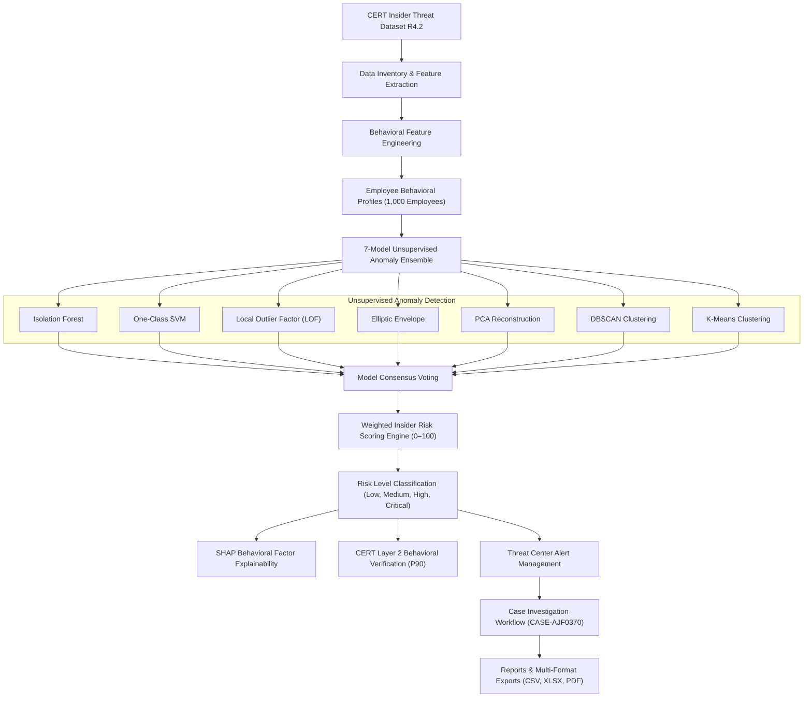
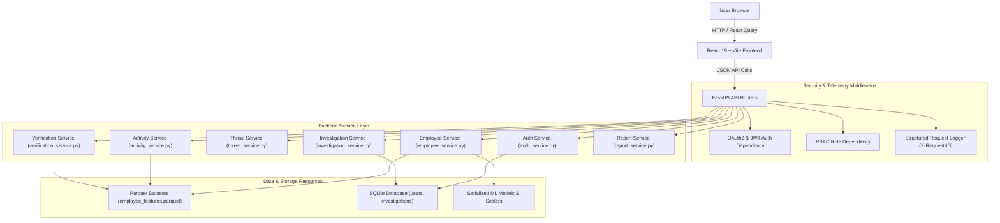

# Insider Threat Behavioral Intelligence System

SentinelAI is an AI-powered insider threat detection and User and Entity Behavior Analytics (UEBA) platform designed to continuously monitor employee activity, evaluate behavioral anomalies, calculate normalized risk scores, and streamline security operations workflows. Built on the authoritative **CERT Insider Threat Dataset (R4.2)**, SentinelAI moves beyond traditional static, signature-based security rules by applying a 7-model unsupervised machine learning ensemble to evaluate complex, multi-dimensional log telemetry across enterprise environments.

The platform provides an end-to-end security solution that unifies data ingestion, behavioral feature engineering, multi-model anomaly detection, weighted risk scoring, SHAP-based feature explainability, CERT Layer 2 behavioral verification, threat investigation workflows (`CASE-AJF0370`), role-based access control (RBAC), structured logging middleware, automated testing, and multi-format reporting (CSV, XLSX, PDF) within a cyber command-center user interface.

---

## Project Overview

| Aspect | Details |
|---|---|
| **Domain** | Cybersecurity / User & Entity Behavior Analytics (UEBA) |
| **Primary Dataset** | CERT Insider Threat Dataset R4.2 (1,000 Evaluated Employees) |
| **Detection Approach** | Unsupervised Machine Learning Anomaly Detection |
| **ML Ensemble** | 7-Model Ensemble (Isolation Forest, One-Class SVM, LOF, Elliptic Envelope, PCA, DBSCAN, K-Means) |
| **Risk Scoring Model** | 0–100 Normalized Weighted Scoring Engine (Anomalies 35%, Misuse 25%, Violations 20%, Deviations 10%, History 10%) |
| **Layer 2 Verification** | CERT Population-Level Statistical Baseline Validation (P90 Thresholds) |
| **Authentication** | OAuth2 Password Flow + JWT Bearer Tokens |
| **Authorization** | Role-Based Access Control (Security Analyst, SOC Engineer, Security Manager, Administrator) |
| **Frontend Stack** | React 19, Vite, Tailwind CSS, Framer Motion, Recharts, TanStack React Query |
| **Backend Stack** | Python 3.11, FastAPI, Uvicorn, Pydantic v2, SQLAlchemy, Alembic |
| **Reporting & Export** | 19 Canonical Intelligence Reports (CSV, Excel/XLSX, Styled PDF Exports) |

---

## Problem Statement

Traditional enterprise security monitoring relies heavily on fixed, signature-based rules and threshold alerts (e.g., failed login counters or known malicious IP blocks). However, insider threats—such as data exfiltration, privilege misuse, and unauthorized resource hoarding are committed by authorized internal users operating within legitimate permission boundaries. Consequently, insider threat activities manifest as subtle behavioral deviations rather than explicit rule violations.

Detecting these threats requires analyzing complex, high-volume activity logs across multiple dimensions (logon times, file system access, USB removable media usage, email communication, and web browsing). SentinelAI addresses this challenge by establishing population-level statistical baselines, applying multi-model unsupervised anomaly detection to identify statistical outliers, deriving model consensus, computing transparent risk scores, and delivering explainable behavioral metrics to security analysts.

---

## Objectives

The system implements the following core engineering and security objectives:
- **Multi-Source Activity Ingestion**: Ingest and structure log telemetry across logon, file, email, HTTP web, and USB device streams.
- **Behavioral Profile Extraction**: Engineer statistical feature vectors capturing temporal patterns, off-hours activity, and event volumes.
- **Unsupervised Anomaly Ensemble**: Train and execute 7 distinct unsupervised ML models to detect anomalous behavior without reliance on ground-truth attack labels.
- **Insider Risk Scoring & Consensus**: Calculate normalized 0-100 risk scores combining model outputs, anomaly severity, and consensus voting.
- **Behavioral Explainability**: Generate SHAP-based feature contribution breakdowns explaining the key factors behind employee risk scores.
- **CERT Layer 2 Verification**: Validate ML anomaly alerts against population-level P90 statistical baseline thresholds.
- **Incident Investigation Workflows**: Provide case file creation, timeline tracking, evidence collection, and status escalation for security analysts.
- **Multi-Format Intelligence Reporting**: Support automated generation and export of 19 canonical security reports in CSV, XLSX, and multi-page PDF formats.
- **Role-Based Access Control (RBAC)**: Enforce strict server-side role authorization across Security Analyst, SOC Engineer, Security Manager, and Administrator views.
- **Telemetry & Quality Assurance**: Implement structured request logging, correlation IDs (`X-Request-ID`), readiness probes (`/ready`), and 4 automated test suites.

---

## Complete System Flow

The diagram below illustrates the end-to-end data processing, machine learning, behavioral validation, investigation, and reporting pipeline implemented in SentinelAI:



---

## High-Level System Architecture

SentinelAI follows a decoupled client-server architecture. The React single-page application communicates via Axios and TanStack React Query to FastAPI API endpoints, which resolve security dependencies and route logic to specialized service modules:



---

## Machine Learning Pipeline

The platform utilizes a 7-model unsupervised anomaly detection ensemble to identify suspicious employee behavior without requiring historical attack labels. By combining multiple distinct algorithmic approaches, the ensemble mitigates single-model bias and improves detection accuracy:

1. **Isolation Forest**: Isolates anomalous instances by randomly partitioning feature trees.
2. **One-Class SVM**: Establishes a non-linear decision boundary around normal activity distributions.
3. **Local Outlier Factor (LOF)**: Measures local density deviation relative to k-nearest neighbor profiles.
4. **Elliptic Envelope**: Fits a robust Gaussian covariance envelope to detect multivariate outliers.
5. **Principal Component Analysis (PCA)**: Identifies anomalies based on high reconstruction error along low-variance eigenvectors.
6. **DBSCAN**: Identifies sparse noise data points falling outside dense spatial baseline clusters.
7. **K-Means**: Clusters activity profiles and measures Euclidean distance to assigned cluster centroids.

Feature vectors extracted from employee activity logs pass through each model independently. The ensemble aggregates binary outlier predictions to compute a model consensus percentage ($0\text{--}100\%$) and feed into the risk scoring engine.

---

## Risk Scoring Engine

SentinelAI calculates a normalized **0–100 Insider Risk Score** for every employee using a 5-component weighted mathematical model:

$$\text{Insider Risk Score} = 0.35(\text{Behavioral Anomalies}) + 0.25(\text{Privilege Misuse}) + 0.20(\text{Data Access Violations}) + 0.10(\text{Access Pattern Deviations}) + 0.10(\text{Historical Security Events})$$

### Risk Level Classification

Employees are categorized into four standardized risk severity levels based on their calculated score:
- **Low Risk ($0.0\text{--}24.9$)**: Normal operational activity matching baseline expectations.
- **Medium Risk ($25.0\text{--}49.9$)**: Minor behavioral deviations requiring routine monitoring.
- **High Risk ($50.0\text{--}74.9$)**: Significant anomaly detection and multi-model consensus; prioritized for security triage.
- **Critical Risk ($75.0\text{--}100.0$)**: Severe multi-vector anomalies and high model consensus; triggers immediate incident escalation.

---

## Behavioral Intelligence & UEBA

The behavioral profiling engine extracts temporal, quantitative, and categorical indicators across enterprise activity logs:
- **Logon Activity**: Login/logout timestamps, off-hours access, weekend activity, and midnight logon frequency.
- **File System Operations**: File copy frequency, removable drive file transfers, exfiltration directory access, and file deletion rates.
- **USB & Device Usage**: Removable media connection/disconnection counts, unauthorized USB events, and data transfer volumes.
- **Email Communication**: External email recipient counts, off-hours email transmission, attachment volume, and BCC frequency.
- **Web / HTTP Browsing**: Request counts, external file downloads, cloud storage visits, and unapproved web domain interactions.
- **Feature Explainability**: SHAP (SHapley Additive exPlanations) contribution breakdowns highlight the top behavioral drivers behind flagged risk scores.

---

## CERT Layer 2 Behavioral Verification

To minimize false positive alerts generated by unsupervised ML models, SentinelAI implements a second-stage **CERT Layer 2 Behavioral Pattern Verification Engine**. This service evaluates flagged employees against population-level statistical percentiles (P90 baseline thresholds) across key CERT R4.2 dimensions:

```text
Population Base: 1,000 Employees
ML Flagged Users: 45
Behaviorally Validated: 34
Validation Rate: 75.6%
```

An anomaly alert is confirmed as a verified behavioral threat only when the employee's activity vector exceeds the 90th percentile (P90) threshold of the general employee population baseline.

---

## Application Modules

| Module | Purpose |
|---|---|
| **Dashboard** | Unified executive and operational overview of security posture, risk metrics, and active threats |
| **Threat Center** | Alert triage hub allowing security teams to search, filter, inspect, and resolve threat alerts |
| **Employees** | Detailed employee roster displaying risk levels, model consensus scores, and behavioral profiles |
| **Analytics** | Risk score distribution charts, temporal threat trends, and model performance comparisons |
| **Models** | Model summaries, hyperparameter configurations, and performance evaluation metrics |
| **Explainability** | SHAP-based feature contribution analysis and behavioral driver breakdowns |
| **Verification** | Layer 2 CERT pattern validation against population P90 baseline statistical thresholds |
| **Investigation** | Active case file management, timeline tracking, evidence collection, and status escalation |
| **Reports** | 19 canonical security intelligence reports supporting live CSV, XLSX, and PDF exports |
| **Account** | User profile details, authenticated role information, and session controls |
| **Settings** | Application preferences, theme controls, and system configuration options |
| **User Management** | Administrative RBAC management for user accounts, role assignment, and access status |

---

## Security and Access Control

SentinelAI enforces multi-layered application security:
- **OAuth2 & JWT Authentication**: Secured via FastAPI OAuth2 password flow issuing signed HMAC-SHA256 JWT bearer tokens with configurable expiration.
- **Role-Based Access Control (RBAC)**: Enforces role authorizations across four defined system roles:
  1. **Security Analyst**: Access to core operational views (Dashboard, Threats, Employees, Activity, Analytics, Models, Explainability, Verification, Investigation, Reports).
  2. **SOC Engineer**: Operational monitoring focus (Dashboard, Threats, Activity, Analytics, Models, Explainability, Verification, Investigation, Reports).
  3. **Security Manager**: Executive risk posture focus (Dashboard, Analytics, Threats, Employees, Reports, Verification).
  4. **Administrator**: Platform administration focus (User Management `/users`, System Monitoring, Reports).
- **Server-Side Authorization**: API dependencies evaluate role claims server-side, returning HTTP 403 Forbidden for unauthorized endpoint requests.

---

## Notifications and Monitoring

- **Notification Stream**: Live top-navbar notification popover displaying unread security alerts, status changes, and investigation updates with badge counters and mark-all-read capabilities.
- **Structured Request Logging**: HTTP middleware logs request correlation IDs (`X-Request-ID`), path, method, status code, and execution timing (`X-Response-Time-Ms`) for full auditability without logging sensitive credentials or tokens.
- **Health Probes**: Operational telemetry via `/health` (system health status) and `/ready` (service and database readiness check).

---

## Reporting and Multi-Format Exports

The platform includes a dedicated report generation engine (`report_service.py`) supporting **19 canonical intelligence reports**, including:
- `top_100_suspicious_report` (Top 100 High-Risk Employees)
- `critical_employee_summary` (Critical Risk Profiles)
- `insider_threat_investigation_report` (Active Case File Digest)
- `behavioral_anomaly_summary` (Ensemble Anomaly Breakdown)

### Export Formats
- **CSV**: Standard comma-separated values for data science integration.
- **XLSX**: Multi-tab formatted Microsoft Excel spreadsheets.
- **PDF**: Custom-styled PDF reports featuring repeated table headers across multi-page document exports.

---

## Testing and Validation

The project maintains an automated test suite located in the `tests/` directory:

| Test Suite | Focus Area |
|---|---|
| `tests/test_oauth2_auth.py` | OAuth2 `/token` login flow, JWT generation, `/me` profile resolution, invalid credentials |
| `tests/test_activity_monitoring.py` | Activity summary, types, statistics, timeline aggregation, and employee log endpoints |
| `tests/test_role_dashboards.py` | Role-specific dashboard views, RBAC authorization, and 403 Forbidden enforcement |
| `tests/test_system_and_performance.py` | E2E workflow validation, health/ready probes, and sub-5ms API latency benchmarks |

---

## Key Validation Result

The platform's detection pipeline and regression state have been validated against benchmark test cases:

| Metric | Verified Benchmark Result |
|---|---|
| **Target Employee** | `AJF0370` |
| **Calculated Risk Score** | `100.0` |
| **Risk Level Classification** | `Critical` |
| **Ensemble Models Triggered** | `7/7` Models |
| **Model Consensus** | `100.0%` |
| **Active Investigation Case** | `CASE-AJF0370` |
| **Protected Datasets & Models** | Preserved (0 modifications to baseline Parquet files or ML model binaries) |

---

## Technology Stack

| Component | Technologies |
|---|---|
| **Frontend Framework** | React 19, Vite |
| **Styling & Icons** | Tailwind CSS, Lucide React |
| **Animations & Charts** | Framer Motion, Recharts |
| **State & Data Fetching** | TanStack React Query, Axios |
| **Backend Framework** | Python 3.11, FastAPI, Uvicorn |
| **Data Validation & ORM** | Pydantic v2, SQLAlchemy, Alembic |
| **Authentication** | OAuth2 Password Flow, PyJWT, PassLib / PwdLib |
| **Data & ML Processing** | Pandas, NumPy, Scikit-learn, PyArrow, Parquet |
| **Primary Dataset** | CERT Insider Threat Dataset R4.2 |

---

## Project Structure

```text
Insider-Threat-Behavioral-Intelligence-System/
├── backend/                  # FastAPI backend REST APIs, auth services, ML pipeline, and routers
│   ├── api/                  # API routers (auth, dashboard, threats, employees, activity, etc.)
│   ├── services/             # Core service layer (auth, employee, threat, verification, reports)
│   ├── ml/                   # Machine learning models, feature engineering, and inference engine
│   └── app.py                # FastAPI app initialization, CORS, and structured logging middleware
├── insider-threat-frontend/  # React + Vite frontend single-page cybersecurity web application
│   ├── src/components/       # UI components (sidebar, navbar, dashboard cards, threat tables)
│   └── src/pages/            # Authenticated route pages (Dashboard, Threats, Employees, Reports)
├── datasets/                 # Processed CERT R4.2 dataset feature tables and Parquet files
├── models/                   # Serialized ML model binaries and feature scaling artifacts
├── notebooks/                # Jupyter notebooks for data profiling, feature engineering, and ML training
├── scripts/                  # Data processing scripts, cleaning pipelines, and verification tools
├── tests/                    # Automated testing suite (OAuth2, activity, RBAC, performance)
├── docs/                     # Comprehensive technical documentation and architecture guides
├── reports/                  # Generated CSV, XLSX, and PDF intelligence export files
├── start.ps1                 # Automated Windows PowerShell environment bootstrapper
└── README.md                 # Primary repository presentation documentation
```

---

## Setup and Running

### Automated Startup (Windows PowerShell)
The repository includes an automated PowerShell script (`start.ps1`) that initializes both backend and frontend environments concurrently:

```powershell
.\start.ps1
```

### Manual Setup

1. **Backend Setup**:
   ```bash
   python -m venv venv
   venv\Scripts\activate
   pip install -r requirements.txt
   python -m uvicorn backend.app:app --reload --port 8000
   ```

2. **Frontend Setup**:
   ```bash
   cd insider-threat-frontend
   npm install
   npm run dev
   ```

3. **Application Access**:
   - Web Interface: `http://localhost:5173`
   - Interactive API Documentation: `http://127.0.0.1:8000/docs`
   - System Health Endpoint: `http://127.0.0.1:8000/health`
   - System Readiness Endpoint: `http://127.0.0.1:8000/ready`

---

## Documentation

Detailed technical specifications, architecture guides, and operational manuals are available in the `docs/` directory:

| Document | Description |
|---|---|
| [Architecture](docs/ARCHITECTURE.md) | High-level system architecture and microservices matrix |
| [Installation](docs/INSTALLATION.md) | Environment setup, installation, and deployment guide |
| [Authentication](docs/AUTHENTICATION.md) | OAuth2 Password Flow and JWT token security details |
| [RBAC](docs/RBAC.md) | Role-Based Access Control matrix and permissions |
| [Activity Monitoring](docs/ACTIVITY_MONITORING.md) | CERT R4.2 activity collection and monitoring APIs |
| [Dashboards](docs/DASHBOARDS.md) | Role-specific dashboard views and capabilities |
| [Investigation](docs/INVESTIGATION.md) | Threat investigation workflows and case management |
| [Reports](docs/REPORTS.md) | 19 canonical intelligence reports and multi-format exports |
| [API Reference](docs/API.md) | Complete REST API endpoint documentation |
| [Testing Guide](docs/TESTING.md) | Automated testing suite and validation procedures |
| [Security](docs/SECURITY.md) | Platform security, zero-log policies, and hardening |
| [Monitoring](docs/MONITORING.md) | Structured request logging middleware and telemetry |
| [User Guide](docs/USER_GUIDE.md) | End-user guide for security analysts and SOC teams |

---

## Future Scope

Potential areas for future extension include:
- **Streaming Telemetry Ingestion**: Ingesting real-time Apache Kafka or SIEM event streams.
- **Advanced Deep Learning Models**: Integrating Autoencoder neural networks for multi-variate anomaly detection.
- **Automated Response Actions**: Adding automated account locking and step-up authentication workflows.
- **SIEM / SOAR Integrations**: Direct webhooks for Splunk, Elastic, and Microsoft Sentinel integration.

---

## Project Status

SentinelAI provides a functional insider threat detection platform combining 7-model unsupervised anomaly detection, weighted risk scoring, CERT behavioral verification, case investigation workflows, multi-format reporting, OAuth2/RBAC security, automated test suites, and structured request telemetry.
