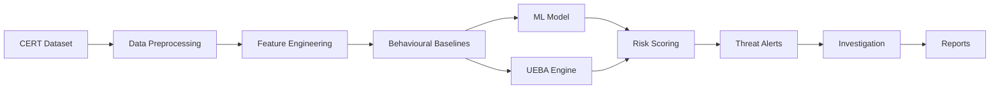

# 🛡️ AI Insider Threat Behavioral Intelligence System

A **Machine Learning-based Insider Threat Detection System** developed as a B.Tech Computer Science project. The system analyzes employee activity, learns individual behavioural patterns, identifies abnormal behaviour, and generates risk scores to support security investigations.

The project uses **CERT Insider Threat Dataset r4.2** and combines **Machine Learning, UEBA, behavioural analysis, and Explainable AI** in a web-based security dashboard.

**Activity Data → Feature Engineering → Behavioural Baseline → ML Prediction → Risk Score → Alert → Investigation**

---

## 🎯 Project Objectives

* Detect unusual employee behaviour using machine learning.
* Build individual behavioural baselines for users.
* Identify deviations from normal activity.
* Generate an understandable risk score.
* Provide explanations for model predictions.
* Support security analysts through alerts and investigation tools.

---

## ✨ Key Features

* 🔐 JWT-based authentication and role-based access
* 👤 Employee behavioural profiles
* 📊 Personal behavioural baselines
* 🤖 Gradient Boosting classification
* 🛡️ UEBA-based risk scoring
* 🚨 Threat alerts and severity levels
* 📡 Live activity monitoring
* 🧠 SHAP-based model explanations
* 🔎 Employee investigation dashboard
* 📄 PDF and Excel report generation
* 📝 Audit logging
* 🐳 Docker support

---

## 🏗️ System Architecture



---

## 🔍 Dataset & Features

The system works with CERT-style activity logs:

* `logon.csv`
* `device.csv`
* `file.csv`
* `email.csv`
* `http.csv`
* LDAP information

Daily user activity is converted into behavioural features such as:

```text
logon_count
off_hours_logons
distinct_pcs
usb_connects
off_hours_usb
files_copied_to_usb
sensitive_files_to_usb
total_emails_sent
external_emails_sent
total_attachments
total_email_size
http_requests
cloud_job_visits
```

Each user's activity is compared with their own historical behaviour rather than only using population-level thresholds.

---

## 🤖 Machine Learning & UEBA

The project uses **Gradient Boosting Classifier** for machine learning-based detection.

The final risk score combines ML probability with behavioural deviation:

```text
Risk Score =
0.55 × UEBA Score +
0.45 × ML Probability × 100
```

### Risk Levels

|  Score | Severity    |
| -----: | ----------- |
| 80–100 | 🔴 Critical |
|  60–79 | 🟠 High     |
|  40–59 | 🟡 Medium   |
|   0–39 | 🔵 Low      |

---

## 🧠 Explainable AI

The system uses **SHAP (SHapley Additive exPlanations)** to help understand model predictions.

The investigation page can show:

* Overall risk score
* Behavioural deviations
* Important features
* SHAP contributions
* User activity timeline
* Alert information

This makes the ML predictions easier for an analyst to interpret.

---

## 🖥️ Web Application

The project provides a web-based security dashboard with:

| Module                | Purpose                              |
| --------------------- | ------------------------------------ |
| Dashboard             | Overall risk and security statistics |
| Live Monitoring       | Recent employee activity             |
| Behavioural Profiling | User behaviour and risk history      |
| Threat Alerts         | High-risk activities                 |
| Investigation         | Detailed user analysis               |
| Reports               | PDF and Excel reports                |

The frontend uses **HTML, CSS and JavaScript** and is served through Flask.

---

## 🚀 Installation & Setup

### 1. Clone the repository

```bash
git clone <your-repository-url>
cd insider-threat-bis
```

### 2. Create virtual environment

**Windows**

```bash
python -m venv .venv
.venv\Scripts\activate
```

**Linux/macOS**

```bash
python -m venv .venv
source .venv/bin/activate
```

### 3. Install dependencies

```bash
pip install -r requirements.txt
```

### 4. Prepare the project

```bash
python scripts/bootstrap.py
```

This generates the development dataset, builds behavioural features, and trains the model.

### 5. Run the application

```bash
python run.py
```

Open:

```text
http://localhost:8000
```

---

## 👤 Demo Login

| Username  | Password     | Role             |
| --------- | ------------ | ---------------- |
| `admin`   | `admin123`   | Administrator    |
| `analyst` | `analyst123` | Security Analyst |
| `viewer`  | `viewer123`  | Viewer           |

> **Note:** Change the default credentials before using the application outside a local development environment.

---

## 📂 Project Structure

```text
insider-threat-bis/
│
├── app/
│   ├── api/
│   ├── ml/
│   ├── services/
│   ├── static/
│   └── templates/
│
├── scripts/
│   ├── generate_data.py
│   ├── build_features.py
│   └── bootstrap.py
│
├── ml_model/
├── data/
├── tests/
│
├── run.py
├── config.py
├── requirements.txt
└── Dockerfile
```

---

## 🧪 Testing

Run the test suite:

```bash
pip install -r requirements-dev.txt
pytest -q
```

Tests cover:

* Data and feature processing
* Behavioural baselines
* UEBA risk scoring
* ML functionality
* API endpoints
* Role-based access
* PDF and Excel reports

---

## 📊 Model Performance

Results on the project's synthetic dataset:

| Metric    | Score |
| --------- | ----: |
| PR-AUC    |  0.89 |
| ROC-AUC   |  0.99 |
| Precision |  0.94 |
| Recall    |  0.83 |
| F1 Score  |  0.88 |

> **Important:** These results are based on synthetic data and should not be treated as real-world production performance. Results may differ significantly on the original CERT dataset.

---

## 🗃️ CERT Insider Threat Dataset

The project is designed around the **CERT Insider Threat Dataset r4.2**.

The original dataset is **not included in this repository**. Users who have legitimate access to the dataset can configure its location and run the feature-engineering and training pipeline.

---

## 🛠️ Technologies Used

**Programming & Backend**

* Python
* Flask
* SQLAlchemy

**Machine Learning**

* Scikit-learn
* Gradient Boosting
* XGBoost
* SHAP

**Data Processing**

* Pandas
* NumPy

**Frontend**

* HTML
* CSS
* JavaScript
* SVG Charts

**Reports & Deployment**

* ReportLab
* OpenPyXL
* Docker
* Gunicorn

---

## ⚠️ Limitations

* Synthetic data can produce better results than real-world data.
* Accurate behavioural baselines require sufficient user history.
* ML predictions should be reviewed by a security analyst.
* A high risk score indicates unusual behaviour and does not prove malicious activity.
* Real-world deployment requires additional security and data validation.

---

## 🎓 Academic Project

This project demonstrates the practical application of:

* Machine Learning
* Data Preprocessing
* Feature Engineering
* Anomaly Detection
* UEBA
* Explainable AI
* REST APIs
* Database Management
* Web Development
* Software Testing

It was developed as a **B.Tech Computer Science & Engineering project** to explore the application of machine learning in cybersecurity.

---

## 👨‍💻 Author

**Mohammad Yusuf**

B.Tech — Computer Science & Engineering
**Pranveer Singh Institute of Technology (PSIT), Kanpur**

---

### 🛡️ AI Insider Threat Behavioral Intelligence System

**Machine Learning • UEBA • Cybersecurity • Explainable AI**

© 2026 **Mohammad Yusuf**
